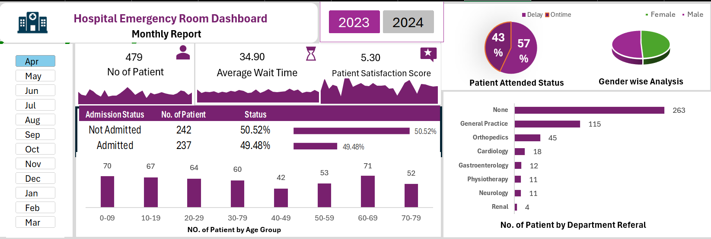

# 🏥 Hospital Emergency Room Dashboard (Excel Project)

[]()
[]()
[]()
[]()

> 📊 An interactive **Hospital Emergency Room Analysis Dashboard** built entirely in **Microsoft Excel**, focusing on patient admissions, waiting time analysis, gender distribution, and departmental referrals.  
> This project helped me understand how to turn healthcare data into meaningful insights using **Excel charts, slicers, and formulas**.

---

## 🌟 **Project Overview**
The objective of this project was to **analyze hospital emergency room performance** by designing a visually engaging and interactive Excel dashboard.  
It allows hospital administrators to monitor key metrics such as:
- Total Patients Attended  
- Average Wait Time  
- Admission vs Non-Admission Ratios  
- Timeliness (within 30 minutes)  
- Gender and Age Group Distributions  
- Department-wise Referral Trends  

---

## 🧭 **Dashboard Preview**
<p align="center">
  
</p>

---

## ⚙️ **Project Structure**
```
hospital-er-dashboard-excel/
│
├─ 📁 assets/       → Dashboard images & presentation
├─ 📁 data/         → Excel file (data + dashboard)
├─ 📁 docs/         → Formulas & project documentation
├─ README.md        → Project overview (this file)
└─ LICENSE          → MIT License
```

---

## 📊 **Key Insights from Dashboard**
| Metric | Value / Observation |
|--------|----------------------|
| **Total Patients** | 479 |
| **Average Wait Time** | 34.9 minutes |
| **Satisfaction Score** | 5.3 |
| **Admission Ratio** | 49.5% admitted / 50.5% not admitted |
| **Top Department Referral** | General Practice (115 referrals) |
| **Timeliness KPI** | 61% patients seen within 30 minutes |

---

## 🧮 **Core Formulas Used**

### ➤ Age Group Classification
```excel
=IF([@[Patient Age]]>=70,"70-79",
IF([@[Patient Age]]>=60,"60-69",
IF([@[Patient Age]]>=45,"45-59",
IF([@[Patient Age]]>=30,"30-44",
IF([@[Patient Age]]>=15,"15-29",
IF([@[Patient Age]]>=5,"05-14","0-4"))))))
```

### ➤ Timeliness Status
```excel
=IF([@[Wait Time]]<30,"Within Time","Delayed")
```

### ➤ Calendar Table (Optional)
```excel
=SEQUENCE(731,1,DATE(2023,1,1),1)
```

### ➤ Admission Ratio
```excel
=COUNTIF([Admission Status],"Admitted") / COUNTA([Admission Status])
```

---

## 🪜 **End-to-End Process**

### 1️⃣ Data Collection
Imported hospital emergency data (admissions, age, gender, department, wait time) into Excel.

### 2️⃣ Data Cleaning
- Removed duplicates and blank rows  
- Standardized department names and formats  
- Ensured all age and wait-time columns are numeric  

### 3️⃣ Feature Creation
- Created Age Group and Timeliness columns using formulas  
- Added KPIs such as total patients, average wait time, and admission rate  

### 4️⃣ Visualization
- Built Pivot Tables for key metrics  
- Designed Pivot Charts for:
  - Admission Status  
  - Age Group Distribution  
  - Gender Breakdown  
  - Department Referrals  
  - Timeliness  

### 5️⃣ Dashboard Design
- Assembled charts in one sheet  
- Added slicers for Month, Gender, and Department  
- Applied clean formatting, icons, and labels  

### 6️⃣ Final Review
- Verified formulas and totals  
- Captured dashboard screenshot  
- Exported final presentation

---

## 🧠 **Skills Demonstrated**
| Skill | Description |
|-------|-------------|
| **Excel Dashboard Design** | Created interactive visuals with slicers and KPIs |
| **Data Cleaning & Transformation** | Standardized and categorized raw data |
| **Analytical Thinking** | Identified meaningful KPIs from healthcare data |
| **Storytelling with Data** | Conveyed insights through design and metrics |
| **Documentation** | Maintained clear structure and learning record |

---

## 🛠️ **Tools Used**
| Tool | Purpose |
|------|----------|
| 🟢 **Microsoft Excel** | Dashboard design, charts, slicers, KPIs |
| 📘 **PowerPoint** | Project presentation & documentation |
| 🧮 **Formulas & Pivot Tables** | Data summarization & analysis |
| 🎨 **Conditional Formatting** | KPI highlighting |

---

## 🎯 **Learning Outcome**
This project enhanced my understanding of:
- End-to-end Excel dashboard development  
- Data storytelling and visualization design  
- Real-world hospital analytics use case  
- Applying **Excel as a BI tool** for insights and decision-making  

> “Transforming raw hospital data into actionable insights — one sheet at a time.”

---

## 📜 **License (MIT)**
```
MIT License

Copyright (c) 2025 Ankit Kumar

Permission is hereby granted, free of charge, to any person obtaining a copy
of this software and associated documentation files (the "Software"), to deal
in the Software without restriction, including without limitation the rights
to use, copy, modify, merge, publish, distribute, sublicense, and/or sell
copies of the Software, and to permit persons to whom the Software is
furnished to do so, subject to the following conditions:

The above copyright notice and this permission notice shall be included in
all copies or substantial portions of the Software.

THE SOFTWARE IS PROVIDED "AS IS", WITHOUT WARRANTY OF ANY KIND, EXPRESS OR
IMPLIED, INCLUDING BUT NOT LIMITED TO THE WARRANTIES OF MERCHANTABILITY,
FITNESS FOR A PARTICULAR PURPOSE AND NONINFRINGEMENT. IN NO EVENT SHALL THE
AUTHORS OR COPYRIGHT HOLDERS BE LIABLE FOR ANY CLAIM, DAMAGES OR OTHER
LIABILITY, WHETHER IN AN ACTION OF CONTRACT, TORT OR OTHERWISE, ARISING FROM,
OUT OF OR IN CONNECTION WITH THE SOFTWARE OR THE USE OR OTHER DEALINGS IN
THE SOFTWARE.
```

---

## 👨‍💻 **Author**
**Ankit Kumar**  
📧 Email: ankitkumar2716@gmail.com  
🔗 [LinkedIn](https:www.linkedin.com/in/ankit-kumar-80888a245)  

> *Made with 💚 in Excel while learning from Satish Dhawale.*

---

## ⭐ **Support**
If you like this project:
- 🌟 **Star** the repository  
- 🔁 **Share** it with others learning Excel dashboards  
- 💬 Provide feedback in the Issues tab  

### 📦 **Download**
You can download the complete project folder here once uploaded to GitHub.
